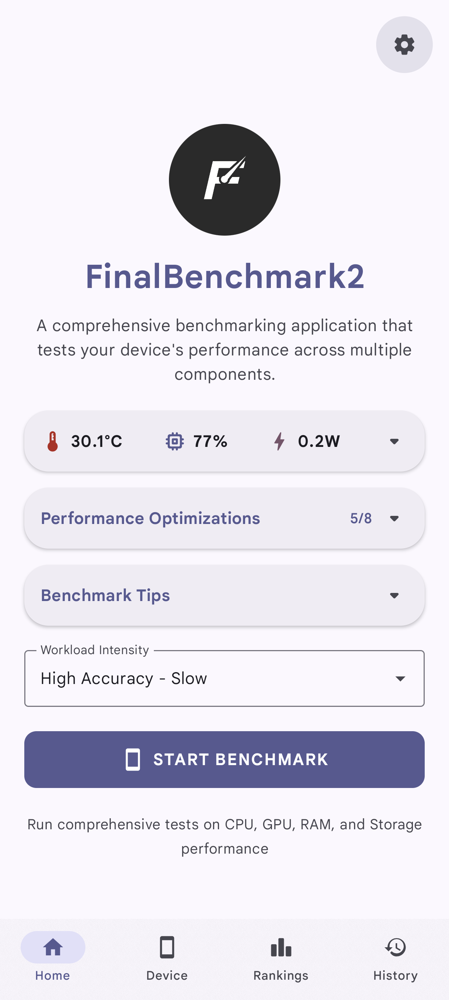
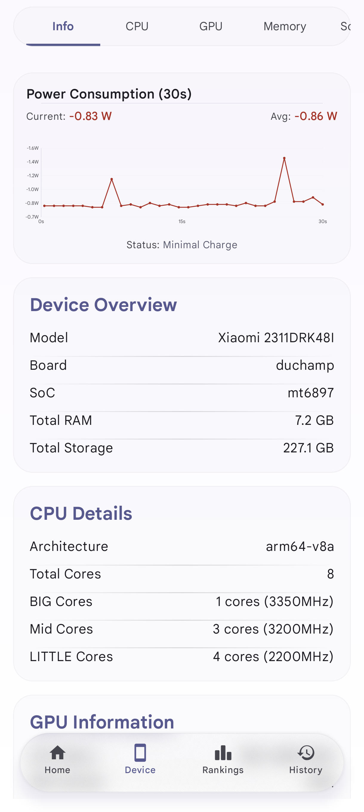
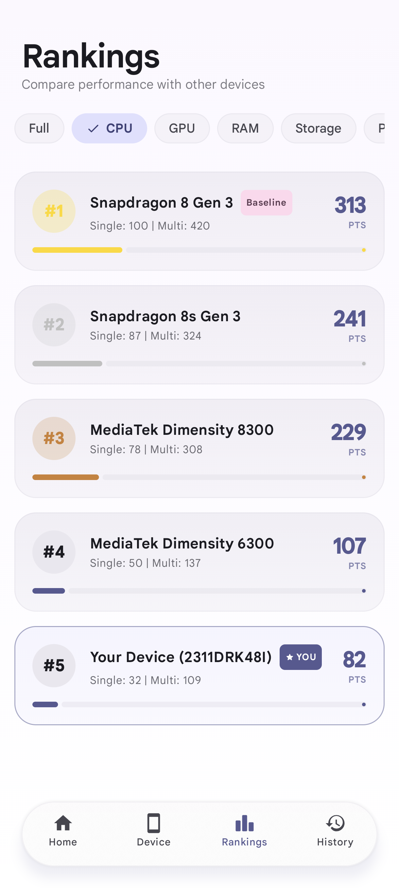
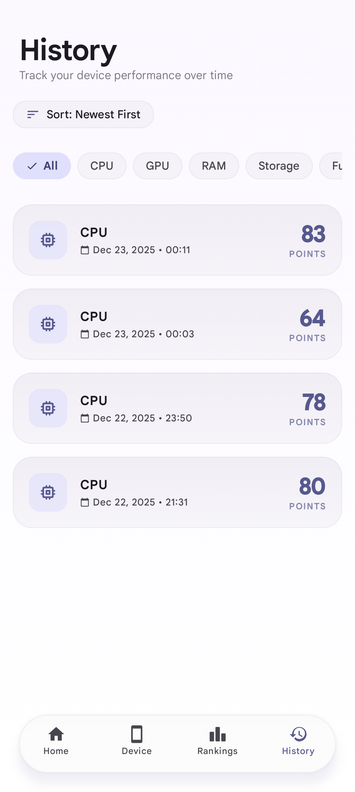
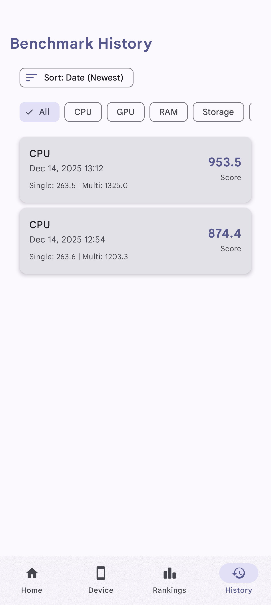
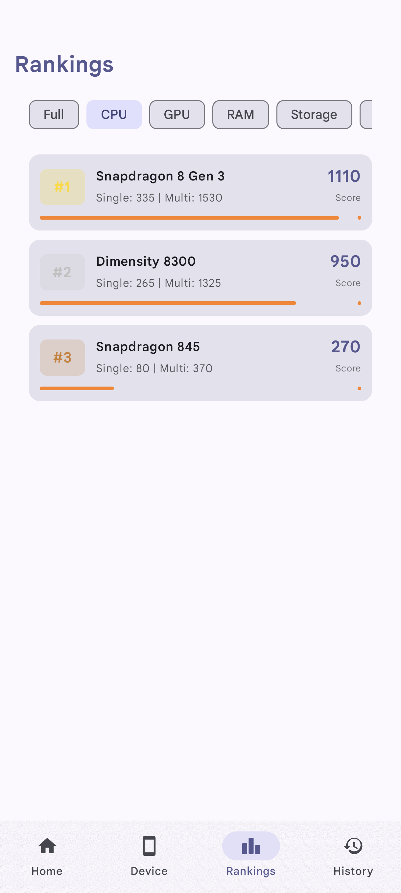
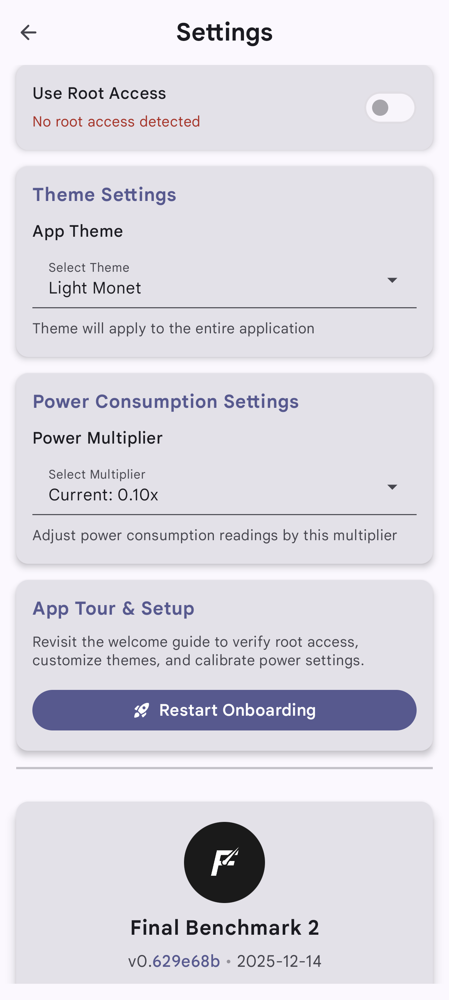

<div align="center">


# FinalBenchmark 2

<a href="https://play.google.com/store/apps/details?id=com.ivarna.finalbenchmark2">
  
</a>

<a href="https://f-droid.org/packages/com.ivarna.finalbenchmark2">
  
</a>

---

[](https://github.com/abhay-byte/finalbenchmark-platform/releases)
[](https://github.com/abhay-byte/finalbenchmark-platform/stargazers)
[](https://github.com/abhay-byte/finalbenchmark-platform/network/members)
[](LICENSE)
[](https://opensource.org/)


A comprehensive Android CPU benchmarking application with detailed scoring and visualization. *(GPU, RAM, and Storage benchmarks coming soon)*

</div>

---

## 📱 Screenshots

<div align="center">
  <table>
    <tr>
      <td align="center">
        
        <br/>
        <sub><b>Home Screen</b></sub>
      </td>
      <td align="center">
        
        <br/>
        <sub><b>Device Info</b></sub>
      </td>
      <td align="center">
        
        <br/>
        <sub><b>Results</b></sub>
      </td>
      <td align="center">
        
        <br/>
        <sub><b>Running Tests</b></sub>
      </td>
    </tr>
    <tr>
      <td align="center">
        
        <br/>
        <sub><b>History</b></sub>
      </td>
      <td align="center">
        
        <br/>
        <sub><b>Rankings</b></sub>
      </td>
      <td align="center">
        
        <br/>
        <sub><b>Settings</b></sub>
      </td>
      <td align="center">
        <br/>
        <sub></sub>
      </td>
    </tr>
  </table>
</div>

---

## 🚀 Features

### ✅ Currently Implemented
- **Comprehensive CPU Benchmarking**: Tests integer operations, floating-point calculations, multi-core performance, compression algorithms, and cryptographic operations
- **Scoring System**: Normalized scores with single-core and multi-core performance ratings
- **Results History**: Stores and displays historical benchmark results
- **Rankings**: Compare your device with other popular devices
- **Export Functionality**: Export results in JSON, CSV, or text formats
- **Modern UI**: Jetpack Compose with Material Design 3 components
- **Thermal Management**: Prevents device overheating during intensive tests

### 🔜 Coming Soon
- **AI/ML Benchmarking**: LLM inference, image classification, object detection, text embedding, and speech-to-text
- **GPU Benchmarking**: Rendering performance, compute operations, and memory bandwidth
- **RAM Benchmarking**: Memory read/write speeds, latency, and bandwidth
- **Storage Benchmarking**: Storage read/write speeds, IOPS, and latency
- **Productivity Tests**: UI rendering, image processing, video encoding, and multi-tasking

## 📋 CPU Benchmark Tests

All tests run in both **Single-Core** and **Multi-Core** modes:

- Prime Generation
- Fibonacci Iterative
- Matrix Multiplication
- Hash Computing (SHA-256/MD5)
- String Sorting
- Ray Tracing
- Compression (LZMA)
- Monte Carlo
- JSON Parsing
- N-Queens

## 🔧 Building

```bash
git clone https://github.com/abhay-byte/finalbenchmark-platform.git
cd finalbenchmark-platform
./gradlew assembleDebug
```

## 📄 License

This project is licensed under the Apache 2.0 License - see the [LICENSE](LICENSE) file for details.

---

<div align="center">

Made with ❤️ by [Abhay](https://github.com/abhay-byte)

</div>
